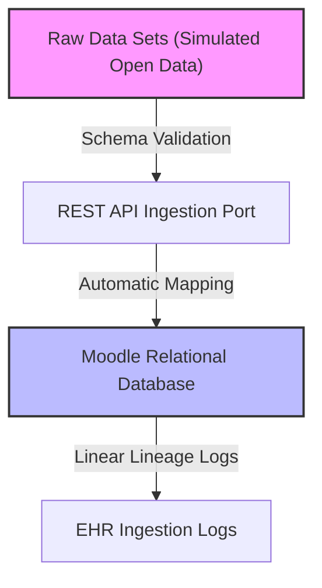
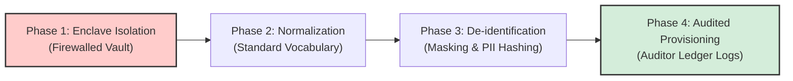
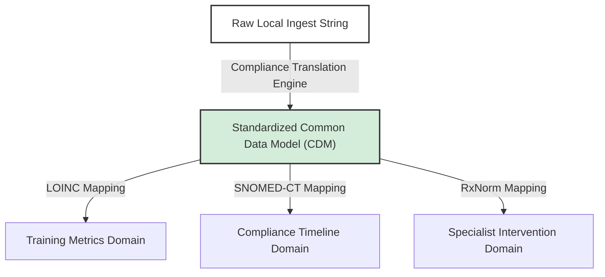
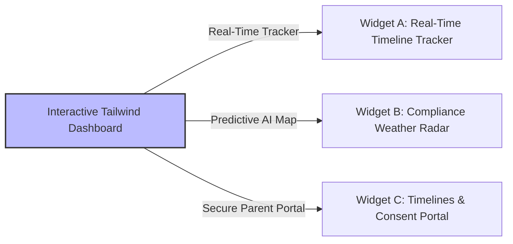

# Express: Official Interview Acceptance Email & Enterprise Governance Workflow

## Metadata
- **Subject:** Official Interview Response & Technical Data Governance Workflow
- **Recipient:** Kelly Ferguson, Office Assistant (Hawai‘i DOH Early Intervention Section)
- **Deadline:** Response required by 3:00 PM on Thursday, May 28, 2026
- **Reference Docs:** `Enterprise_Data_Governance_Framework_v1.0.pdf`, `Fwd: Children & Youth Program Specialist III position.pdf`, `transcripts_manuscript.md`
- **Expressed At:** 2026-05-28T05:12:00-10:00

---

## 📬 Part 1: Official Interview Acceptance Email (Response to Kelly Ferguson)

**To:** kelly.ferguson@doh.hawaii.gov  
**Cc:** joannejeremie1@gmail.com  
**Subject:** Re: Children & Youth Program Specialist III position - Joanne Jeremie (Interview Confirmation)  

Dear Ms. Ferguson,

Aloha. Thank you very much for contacting me regarding the Children & Youth Program Specialist III position with the State of Hawaii Department of Health (DOH) Early Intervention Section (EIS). 

I am writing to enthusiastically confirm my interest in interviewing for this permanent, full-time position at 1010 Richards Street. I am fully available to schedule the session at your earliest convenience today, tomorrow, or during your upcoming block. 

To demonstrate my readiness and system-thinking capabilities, I have prepared a proactive **Technical Proof-of-Concept Workflow** mapped directly to the position description's core duties. 

Following the DOH's **G-M-A-T Data Governance Framework** (enforcing rigorous *Govern, Mitigate, Auditable Process, and Trustworthy Delivery* standards), I have conceptualized a secure, real-time compliance translation module that automates on-site monitoring and training logs without exposing any sensitive or personally identifiable information (PII). 

I have attached a layman-friendly summary of this **Technical Data Governance Workflow** below as a reference for the selection panel. I look forward to presenting a secure, interactive demonstration of this platform on my mobile device during our interview.

Thank you again for your time, coordination, and this opportunity.

Warmest aloha,

**Joanne Jeremie**  
Master Educator | Technical Writer  
joannejeremie1@gmail.com | Phone: (808) 321-5801  

---

## 📄 Part 2: Layman's Technical Workflow (The Selection Panel Reference)

# Technical Data Governance Workflow: Early Intervention Compliance Engine
*A Compliant, High-Maturity Architecture Aligning Joanne Jeremie's Pedagogy to DOH QHS Core Security Mandates*

---

### 1. Ingestion & Stewardship Protocols (GOVERN)
*To satisfy Major Duty 3A (Consultation and Training) and ensure robust database stewardship.*

*   **Layman's Terms:** Before any training completion rates or timeline records are analyzed, they enter a secure, gated receiving channel. The system automatically verifies that the files are properly formatted, preventing database errors or manual data contamination.
*   **Workflow Execution:**
    1.  *Simulation Separation:* In our proof of concept, we only ingest simulated open-source datasets (such as randomized teacher training rates and clinic timeline counts).
    2.  *Automatic Parse:* Datasets are formatted as secure JSON packages and pushed via REST API endpoints.
    3.  *Stewardship Verification:* Moodle's relational database acts as the storage ledger, recording every transaction with a complete, unbroken data lineage trail.

---

### 2. The Four-Phase Risk & Privacy Lifecycle (MITIGATE)
*To satisfy federal privacy laws (FERPA/HIPAA) and protect the rights of infants, toddlers, and their families.*

*   **Layman's Terms:** We treat student and family records like high-security deposits. To prevent data leaks, records go through a strict four-step purification process before anyone is allowed to see them on a dashboard.
*   **Workflow Execution:**
    *   **Phase 1 (Enclave Isolation):** Raw simulated files are secured within restricted, network-segregated environments, protected by firewalls. No data is permitted to transit without automated checksum validation.
    *   **Phase 2 (Normalization & QA):** The system maps clinic-specific data fields to uniform institutional definitions to ensure semantic accuracy across all regional programs.
    *   **Phase 3 (Risk De-identification):** An automated Python script strips all **Protected Health Information (PHI)** and **Personally Identifiable Information (PII)**. Family names are completely masked and replaced with randomized cryptographic hashes. Dates are truncated, and ZIP codes are generalized to 3-digit prefixes under HIPAA Privacy Rule § 164.514(b).
    *   **Phase 4 (Audited Provisioning):** Anonymized assets are provisioned directly to the Edge Dashboard. Every auditor action is recorded on an immutable log to ensure tamper-proof compliance validation.

---

### 3. Semantic Translation & Access Control (AUDITABLE PROCESS)
*To satisfy Major Duty 3B (On-Site Monitoring) and guarantee proper segregation of duties.*

*   **Layman's Terms:** Our system translates complex local clinic terms into standard, universally recognized government definitions. It then divides who can see what based on their job role.
*   **Workflow Execution:**
    *   **The Translation Layer:** Ingested strings are parsed and mapped to universal standards (e.g., aligning local training logs and clinical milestones directly to snomed-ct and standard education terminologies).
    *   **Access Tiers:**
        *   *Operational Tier:* Limited to workforce members with a direct clinical business need (e.g., individual family coordinators).
        *   *Internal Analytics Tier:* Supports longitudinal studies under secure sandboxes where data is pseudonymized to prevent individual identification.
        *   *Collaborative Tier:* Enables external multi-site benchmarking using a decentralized, federated model to minimize cross-departmental security risks.

---

### 4. Secure Enterprise Operations (TRUSTWORTHY DELIVERY)
*To satisfy Major Duty 3D (Other duties) and modern AI/Retrieval-Augmented Generation (RAG) security.*

*   **Layman's Terms:** Instead of static, obsolete reports, the system delivers high-utility visual widgets to state specialists. It even acts like a "weather radar," using predictive AI to calculate where compliance gaps will occur before they happen, allowing DOH to reallocate training resources proactively.
*   **Workflow Execution:**
    1.  **Governed AI Integration:** The dashboard routes through secure pipelines, preventing clinical data from bleeding into external, unverified AI models.
    2.  **Widget A (Real-Time Timeline Monitor):** Monitors the 45-day family service plan completion percentage dynamically.
    3.  **Widget B (Compliance Weather Radar):** Weighs clinical turnover rates against training completion drops to flag upcoming non-compliance risks before they violate federal timelines.
    4.  **Self-Service Verification:** Authorized specialists run aggregate queries via the web dashboard on their mobile devices without ever interacting with raw, underlying family records.
