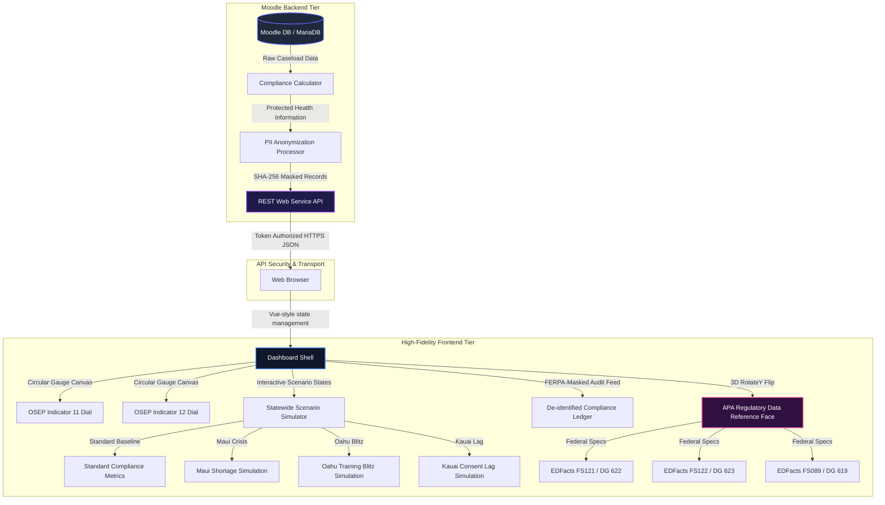
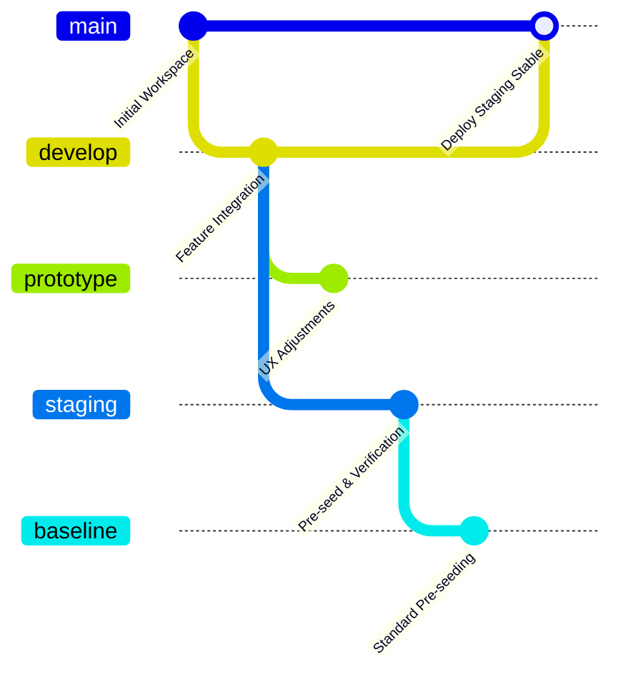

# Hawaii DOH Early Intervention Section (PEICS) - ECIDS Feasibility Study & Compliance Monitoring

This repository contains the prototype and production-ready source code for the **Hawaii Department of Health (DOH) Early Intervention Section (EIS) Compliance Monitoring Platform**. Developed as part of the **Early Childhood Integrated Data System (ECIDS)** feasibility study, this platform serves as an interactive demonstration of real-time compliance monitoring for federal OSEP Indicators, powered by a customized Moodle local plugin (`local_onsitemonitoring`) and a high-fidelity 3D compliance dashboard.

---

## 1. System Architecture

The application is structured as a bespoke Moodle local plugin that integrates a secure backend API with a glassmorphic front-end dashboard. The diagram below illustrates the end-to-end data flow, from the database tier through the anonymization filters to the interactive browser interface.



---

## 2. Multi-Branch Git Strategy

To maintain operational integrity across development stages, the repository is structured into five distinct deployment branches. This maps to standard pipeline governance protocols:



### Branch Definitions & Roles

| Branch Name | Deployment Environment | Access Level | Description |
|:---|:---|:---|:---|
| **`main`** | Staging / Presentation | Read-Only (Approved PRs) | The stable production-ready demo code configured with verified API tokens for live stakeholder review. |
| **`develop`** | Integration Testing | Team Write | The primary work branch where features are integrated and tested against local Moodle sandbox databases. |
| **`prototype`** | Experimental UX sandbox | Developer Write | Used for high-fidelity front-end design iterations, layout tuning, and glassmorphic micro-animation tests. |
| **`baseline`** | Standard Pre-Seeding | System/Deploy | Contains pre-configured baseline database seeding scripts and clean CSV files for system installation. |
| **`staging`** | Remote Verification | CI/CD Automated | Automates ProxyJump SSH transfers to the remote testing server (`vault.pxg.studio`) to run PHP upgrades. |

---

## 3. Core Dashboard Features

1. **3D Card Flip Mechanics:** Employs CSS 3D perspective transforms to toggle between the **Interactive Monitoring Dashboard** (front face) and the **APA-Cited Regulatory Data Sheet** (back face), minimizing cognitive clutter for users.
2. **Statewide Scenario Simulator:** Seeded with four real-world states:
   * `baseline`: Standard Hawaii operational rates.
   * `shortage`: Simulated staffing emergency on Maui, illustrating critical delays.
   * `blitz`: Simulates a training blitz on Oahu, showing accelerated compliance rates.
   * `consent_delay`: Simulates systemic administrative delays on Kauai.
3. **FERPA-Compliant Audit Ledger:** Instantly masks student Personally Identifiable Information (PII) using a mock cryptographic SHA-256 hash algorithm to satisfy 34 C.F.R. § 99 regulations. Features an authorized toggle to review decrypted labels for authorized administrators under NIST SP 800-53 standards.
4. **EDFacts Data Mapping:** Houses complete longitudinal CSV database files and schema representations for **FS121 (DG 622)**, **FS122 (DG 623)**, and **FS089 (DG 619)**.

---

## 4. Local Quickstart & Development

### Prerequisite Setup
Ensure you have access to a Moodle server environment (running PHP 7.4+ and MariaDB/MySQL).

1. Clone this repository into your Moodle local plugins directory:
   ```bash
   git clone git@github.com:PxG-Studio/hawaii-doh-ecids-demonstration.git local/onsitemonitoring
   ```
2. Run Moodle upgrades to register the new database fields and capabilities:
   ```bash
   php admin/cli/upgrade.php --non-interactive
   ```
3. Seed the compliance demonstration database:
   ```bash
   php local/onsitemonitoring/scripts/seed_demo_data.php
   ```
4. Run the web service setup script to generate your secure presentation API token:
   ```bash
   php local/onsitemonitoring/scripts/setup_webservice.php
   ```

### Launching the Frontend
Open the dashboard by appending your generated token to the local URL:
```
https://YOUR-MOODLE-URL/local/onsitemonitoring/dashboard/?token=YOUR_TOKEN&tenant=DEMO001
```
*(If no token is supplied in the URL, the dashboard automatically falls back to Standalone Sandbox Mode, allowing complete operational testing).*
